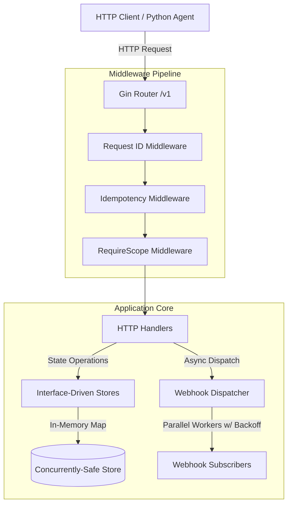
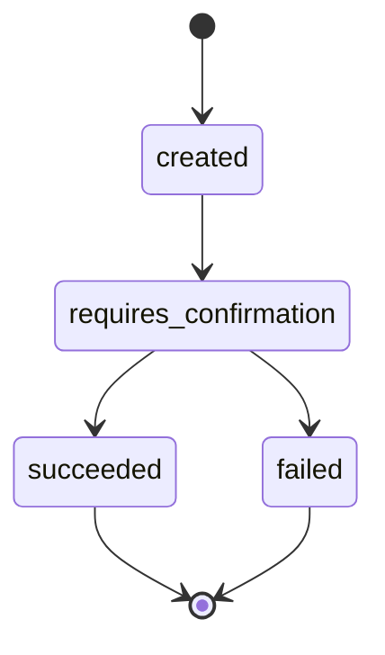

# Agentic Commerce API & Shopping Agent

An API-first commerce and payments backend purpose-built for autonomous AI agents. The Go service exposes a Stripe-style REST API with idempotent request handling, HMAC-signed webhook delivery, read-your-writes cart consistency, and scoped bearer-token auth — while a companion Python agent (Gemini-powered) drives the entire purchase flow end-to-end without human intervention.

---

## 🏗️ System Architecture

The project is structured around clean architectural boundaries. It isolates routing, middleware pipelines, business logic handlers, and data repositories.



---

## 🛠️ Key Design Decisions & Core Patterns

### 1. Interface-Driven Extensibility
Handlers (`CartHandler` and `PaymentHandler`) are decoupled from concrete store implementations by depending on the newly introduced `CartStorer` and `PaymentStorer` interfaces. This allows developers to easily swap out volatile in-memory databases with real relational/NoSQL stores, or drop in mocks for unit and integration testing.

### 2. Deterministic Payment State Machine
To prevent duplicate checkouts or invalid transactions, payments follow a strict state-transition graph:


*   **Terminal States:** Once a payment intent transitions to `succeeded` or `failed`, no further transitions are allowed.
*   **Type-Safe Transitions:** State changes return explicit transition errors instead of generic strings, allowing handlers to respond with precise HTTP codes.

### 3. Concurrency-Safe Memory Store (Deep Copy-on-Read / Copy-on-Write)
To avoid data race conditions in a multi-threaded Go application serving concurrent HTTP requests, the store layer implements deep copying during retrievals (`Get`) and mutations (`Save`). Handlers never obtain pointers to memory maps directly, preventing write-conflicts and panic errors.

### 4. Structured JSON Logging (`slog`)
The system leverages Go's standard structured logging framework `log/slog`. Events (server startup/shutdown, HTTP requests, mock gateway transactions, and webhook retry attempts) are printed in standardized JSON format, facilitating parsing by log collectors like Datadog, Splunk, or Elasticsearch in cloud environments.

### 5. Dynamic Mandate Verification (JWT / RS256)
To authorize checkout intents securely:
*   The Python AI Client generates a transaction hash of the cart contents and signs it with an RSA private key using the **RS256** algorithm.
*   The Go backend verifies the JWT signature using the corresponding public key and compares the cryptographic hash against the database cart details to prevent tampering or replay attacks.
*   The verification key is configured dynamically using the `MANDATE_PUBLIC_KEY_PEM` environment variable (supporting escaped newlines), preventing hardcoded secrets in codebase source files.

### 6. Idempotency Middleware with TTL Eviction
`POST` endpoints accept an `Idempotency-Key` header. Incoming duplicate requests are intercepted early in the middleware pipeline and served the cached response immediately. A background worker periodically evicts expired entries using a configurable Time-To-Live (TTL).

### 7. Asynchronous Webhook Engine
Webhook events are recorded in an event log and dispatched to subscribers asynchronously. Dispatch workers process events in parallel, complete with an exponential backoff retry mechanism (max 3 retries) and random jitter to handle transient client timeouts.

---

## ⚠️ Architectural Gaps & Production Trade-offs

This project is a demonstration of architectural patterns and **is not production-ready in its current state**. Below are the key trade-offs made and how they should be addressed for a production deployment:

| Category | Current Implementation (Demo) | Production Requirement |
| :--- | :--- | :--- |
| **Data Persistence** | Volatile in-memory maps behind Go interfaces (`CartStorer`, `PaymentStorer`). | Distributed database (e.g., PostgreSQL, DynamoDB) with transaction logs. |
| **Concurrency Control** | Simple copy-on-read/write. No conflict resolution. | Optimistic Concurrency Control (OCC) using version checking to prevent lost updates. |
| **Key Management** | Dynamically loaded via environment configuration. | Secret storage (AWS Secrets Manager, HashiCorp Vault) or a JWKS endpoint. |
| **Authentication** | Shared static Bearer tokens loaded in memory. | OIDC provider or OAuth2 server with dynamic token issuing and rotation. |
| **Idempotency Store** | In-memory map. Cache lost on application restart. | Distributed cache (e.g., Redis) with automatic TTL eviction. |
| **Webhook Delivery** | Simple Go channel workers. | Durable queue system (e.g., RabbitMQ, AWS SQS) to guarantee delivery. |

---

## 📂 Project Structure

```
├── commerce_agent/      # Python-based Gemini AI agent chatbot
│   ├── agent.py         # ReAct loop & LLM chat orchestration
│   ├── client.py        # HTTP client wrapping Go API endpoints
│   ├── jwt_helper.py    # RS256 signing of purchase mandates
│   └── main.py          # Interactive/one-shot CLI entrypoint
├── config/              # Configuration loader (env vars with defaults)
├── gateway/             # External payment gateway interface & mocks
├── handlers/            # HTTP Handlers (validation and store orchestration)
├── middleware/          # Gin Middlewares (Auth, RequestID, Idempotency, Admin Key)
├── models/              # Go structs representing database entities
├── store/               # In-memory repositories & state machine
├── tests/               # Automated unit & integration tests
│   ├── auth_flow_test.go
│   ├── cart_flow_test.go
│   ├── idempotency_test.go
│   ├── payment_flow_test.go
│   └── test_helpers.go
├── webhook/             # Webhook event dispatcher & backoff retry logic
├── .env.example         # Environment template file
├── .golangci.yml        # Linter configuration
├── go.mod               # Go module configuration
├── Makefile             # Build automation shortcuts
└── README.md            # Project documentation
```

---

## 🚀 Getting Started

### 1. Prerequisites
*   **Go**: version 1.22 or later
*   **Python**: version 3.10 or later
*   **Make**: optional, for automation commands

### 2. Configure & Run the Go Backend
1. Copy the template environment file:
   ```bash
   cp .env.example .env
   ```
2. Start the server (runs on port `8080` by default):
   ```bash
   go run main.go
   # Or using make:
   make run
   ```

### 3. Configure & Run the Python Agent
1. Navigate to the agent directory and create a virtual environment:
   ```bash
   cd commerce_agent
   python -m venv .venv
   ```
2. Activate the virtual environment:
   *   **Windows**: `.venv\Scripts\activate`
   *   **macOS/Linux**: `source .venv/bin/activate`
3. Install dependencies:
   ```bash
   pip install -r requirements.txt
   ```
4. Copy the environment file and add your `GEMINI_API_KEY`:
   ```bash
   cp .env.example .env
   ```
5. Run the agent in **Interactive Chat Mode**:
   ```bash
   python -m commerce_agent.main
   ```
6. Alternatively, run in **One-Shot Mode**:
   ```bash
   python -m commerce_agent.main "Buy the cheapest biscuit in INR"
   ```

---

## 🧪 Testing

To run the full suite of automated unit and integration tests covering the entire application (handlers, middleware, state transitions, authentication, and idempotency):

```bash
go test -v ./...
```

---

## 📋 API Reference

### 1. Authentication
Endpoints (except for token creation) require a Bearer token in the `Authorization` header:
```http
Authorization: Bearer <your-access-secret>
```

#### **Create Token**
*   **Endpoint:** `POST /v1/tokens`
*   **Header:** `X-Admin-Key: <ADMIN_API_KEY>`
*   **Payload:**
    ```json
    {
      "scopes": ["products:read", "carts:write", "carts:read", "payments:write"],
      "spend_limit_paise": 100000,
      "expires_in": "2h"
    }
    ```
*   **Response:** `201 Created` returning the generated token containing the authenticating `secret`.

---

### 2. Purchase Flow Example

#### **Step 1: Browse Products**
*   **Request:** `GET /v1/products`
*   **Response:** `200 OK` listing the catalog of products.

#### **Step 2: Create a Cart**
*   **Request:** `POST /v1/carts`
*   **Response:** `201 Created` with a new cart object.

#### **Step 3: Add Items to Cart**
*   **Request:** `POST /v1/carts/<cart_id>/items`
*   **Payload:**
    ```json
    {
      "product_id": "prod_1",
      "quantity": 2
    }
    ```

#### **Step 4: Create a Payment Intent (With JWT Mandate)**
*   **Request:** `POST /v1/payment-intents`
*   **Payload:**
    ```json
    {
      "cart_id": "cart_uuid_goes_here",
      "currency": "INR",
      "mandate_jwt": "<signed-rs256-token>"
    }
    ```

#### **Step 5: Confirm Payment**
*   **Request:** `POST /v1/payment-intents/<intent_id>/confirm`
*   **Response:** `200 OK` with the intent status updated to `succeeded`.
